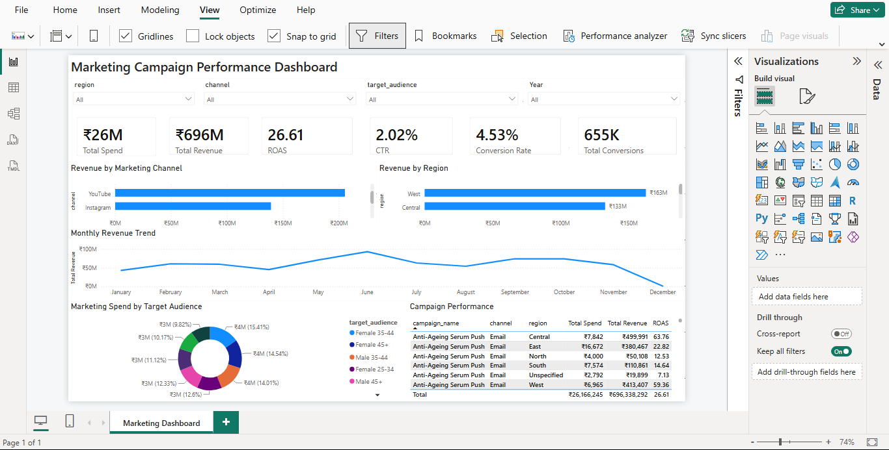

# GlowNest FMCG — Marketing Campaign Performance Analysis

End-to-end marketing analytics project covering data cleaning (Excel), database + analysis
(MySQL), and an interactive dashboard (Power BI) for a multi-channel FMCG campaign dataset.



## Business Problem
GlowNest (fictional FMCG personal care brand) runs marketing campaigns across five channels —
Instagram, Facebook, Google Ads, Email, and YouTube — targeting different regions and audience
segments. This project identifies which channels, regions, and audiences deliver the best
ROAS (Return on Ad Spend), to guide future budget allocation.

## Project Structure
```
/excel     -> GlowNest_Raw_Marketing_Data.xlsx (raw), GlowNest_Cleaned_Analysis.xlsx (cleaned + formulas)
/data      -> campaigns_final.csv (cleaned, deduplicated dataset used for SQL & Power BI)
/sql       -> glownest_analysis.sql (schema + business-question queries)
/powerbi   -> Marketing_Campaign_Dashboard.pbix, dashboard_screenshot.png
README.md
```

## Approach
*(All steps below were carried out by me, end-to-end, as a self-directed portfolio project.)*

**1. Excel — Cleaning & Preparation**
The raw export had inconsistent channel/region naming, three different date formats, missing
Spend/Revenue values, negative Click entries, and duplicate rows. I built a fully
formula-driven cleaning layer:
- Lookup tables + `INDEX/MATCH` to standardize channel/region names
- Nested `IF` + text functions (`LEFT/MID/RIGHT/FIND`) to safely parse mixed date formats
- `AVERAGEIFS` to impute missing Spend/Revenue using channel averages
- `COUNTIF` to flag and remove duplicate records
- Row-level KPIs: CTR, CPC, CPA, ROAS, Conversion Rate
- `SUMIFS`/`AVERAGEIFS` roll-ups by channel, region, and month

**2. SQL — Business-Question Analysis**
I imported the cleaned data (820 records) into MySQL Workbench and wrote queries to answer
specific business questions: channel and region ROAS ranking (`GROUP BY`), underperforming
high-spend campaigns (`HAVING`), performance tiering (`CASE WHEN`), monthly trend, and top
campaign per channel (`RANK() OVER PARTITION BY`).

**3. Power BI — Interactive Dashboard**
(Full breakdown of every visual and DAX measure: [powerbi/DASHBOARD_GUIDE.md](powerbi/DASHBOARD_GUIDE.md))

I built 16 visuals in Power BI Desktop on the cleaned dataset, using DAX measures (not raw
column averages) for every KPI:
- 6 KPI cards: Total Spend, Total Revenue, ROAS, CTR, Conversion Rate, Total Conversions
- Revenue by Channel and by Region (bar charts)
- Monthly Revenue Trend (line chart, using a dedicated Calendar table)
- Marketing Spend by Target Audience (donut chart)
- Campaign Performance detail table
- Slicers for Region, Channel, Year, and Target Audience for full interactivity

## Key Insights
- **Google Ads delivered the highest ROAS (28.38x)** and the highest total revenue among all
  channels — the strongest candidate for increased budget allocation.
- Overall campaign performance: ₹2.62 crore spent generated **₹6.96 crore in revenue**, an
  overall ROAS of **26.61x**.
- Average CTR across all campaigns was **2.02%**, with a conversion rate of **4.53%** on clicks.
- **West and Central regions** returned the strongest revenue and ROAS among clearly-identified
  regions.
- A data quality gap was found and documented: ~5% of records were missing a region entry —
  flagged as a recommendation for better data collection on future campaigns.
- A subset of high-spend campaigns underperformed significantly (ROAS below 15x), identified via
  SQL for review before renewal.

## Tools Used
Excel (advanced formulas, no VBA) · MySQL Workbench · Power BI Desktop (DAX measures)

## Author
Built independently by **Pratul** **kumar** as a self-directed portfolio project (MBA graduate,
IT & Marketing specialization) to demonstrate hands-on Excel, SQL, and Power BI skills.
  [www.linkedin.com/in/pratultomar89] · [Pratultomar046@gmail.com]
